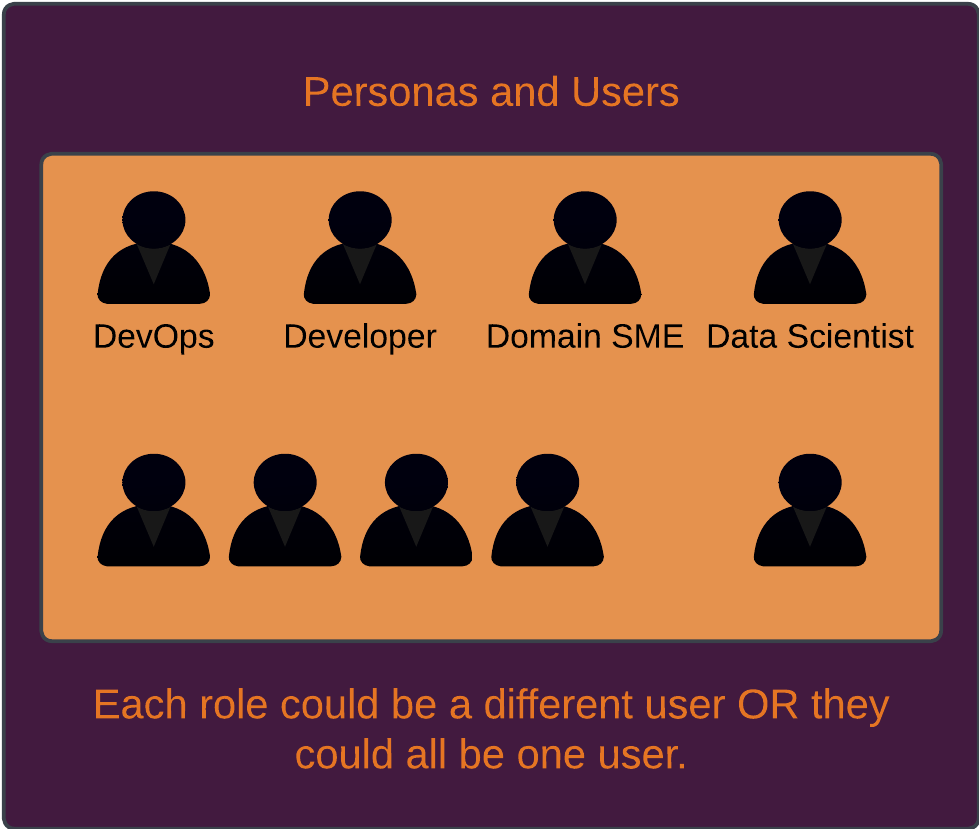

# DBX Metadata Generation

# GenAI-Assisted Metadata Generation (a.k.a `dbxmetagen`)

# `dbxmetagen` Overview
### This is a utility to help generate high quality descriptions for tables and columns to enhance enterprise search and data governance, improve Databricks Genie performance for Text-2-SQL, and generally help curate a high quality metadata layer for enterprise data. In addition, it can identify PI and classify it into PII, PHI, PCI.

While Databricks does offer [AI Generated Documentation](https://docs.databricks.com/en/comments/ai-comments.html), this is not sustainable at scale as a human must manually select and approve AI generated metadata in a UI. This utility, `dbxmetagen`, helps generate table and column descriptions, and identify and classify PI at scale in a bulk fashion with multiple options for bringing the outputs into an organization's SDLC. Note that the need for human approval has not changed, simply that bulk generation and an ability to integrate with SDLC through customizable DDL or direct application significantly streamline the process.

### Disclaimer

AI generated comments are not always accurate and comment DDLs should be reviewed prior to modifying your tables. Examples of data may appear in column names depending on settings, and if you have specific security guidelines you may need to be aware of where and how you run your code in order to maintain appropriate data security. Databricks strongly recommends human review of AI-generated comments to check for inaccuracies and harmful content, and to check if there are concerns with PI or other data exfiltration issues through comments. While the model has been guided to avoids generating harmful or inappropriate descriptions, you can mitigate this risk by setting up [AI Guardrails](https://docs.databricks.com/en/ai-gateway/index.html#ai-guardrails) in the AI Gateway where you connect your LLM. No guarantees are made, and human review is the responsibility of the user - this is an accelerator, not a replacement for human domain knowledge.
Unless explicitly set not to, this utility does inspect data and send it to the model endpoint specified.

Requirements such as HIPAA compliance must be considered by the customer in light of their infrastructure and the model used. For example, the default PPT foundational models are not HIPAA compliant, and customers must choose an option such as a provisioned throughput endpoint or a HIPAA-compliant OpenAI external model. Compliance is the responsibility of the user.

### Solution Overview:
There are a few key sections in this notebook:
- User guide setup using the configuration in variables.yml
- Function definitions for:
  - Retrieving table and column information from the list of tables provided in `notebooks/table_names.csv`
  - Sampling data from those tables, with exponential backoff, to help generate more accurate metadata, especially for columns with categorical data, that will also indicate the structure of the data. This is particularly helpful for [Genie](https://www.databricks.com/product/ai-bi/genie). This sampling also checks for nulls.
  - Use of `Pydantic` to ensure that LLM metadata generation conforms to a particular format. This is also used for DDL generation to ensure that the DDL is always runnable.
  - Creation of a log table keeping track of tables read/modified
  - Creation of DDL scripts, one for each table, that have the DDL commands to `ALTER TABLE` to add comments to table and columns. This is to help integrate with your CI/CD processes, in case you do not have access in a production environment
- Application of the functions above to generate metadata and DDL for the list of tables provided in `notebooks/table_names.csv`

### User Guide

Four personas are expected for use of this project. Each of them will have a specific role in making sure that this tool is used properly.

Note that these personas do not need to be experts in the domain, but the more knowledge they have the more effective they can be, especially when trying to extend this tool.

Finally, these personas can in theory all be the same person, though this would be unlikely at many organizations. These are not different people, they are different roles or personas. 

The simplest workflow available can just be done by one user. Clone the repo into a Databricks Git Folder, or unpack into a Workspace folder. Update variables.yml in the project root. Specifically, you will need to update the host and catalog name. Review variables.yml and update necessary variables. You can update the env and mode widgets in notebooks/generate_metadata. Update table_names.csv in notebooks/table_names.csv. Alternatively, use an asset bundle approach, either in the web terminal or locally. Web terminal is not compatible with privatelink.

Optional workflow:
1. Adjust PI definitions
1. Add to acronyms
1. Adjust other secondary options. There are a number of possibe variables to adjust in variables.yml, explained in the yml file with descriptions.

 

 

We also provide a more complex workflow that offers more options, but significantly more complexity. Please test out the simplified workflow to start.

### Setup
1. Clone the Repo into Databricks or locally
1. If cloned into Repos in Databricks, one can run the notebook using an all-purpose cluster without further deployment, simply adjusting variables.yml and widgets in the notebook.
   1. Alternatively, run the notebook deploy.py, open the web terminal, copy-paste the path and command from deploy.py and run it in the web terminal. This will run an asset bundle-based deploy in the Databricks UI web terminal.
   1. The end result of this approach is to deploy a job. Table names can be added to the job itself for users with CAN MANAGE, or to table_names.csv as for the interactive workload.
   1. Default workflow runs both PI identification/classification and comment generation.
1. Library installs in pyproject.toml should not need to be adjusted. A pre-commit hook builds a requirements.txt that's referenced by the main notebook. Expect that library installs may be different for model registration in advanced usage (not fully implemented).
1. If cloned locally, we recommend using Databricks asset bundle build to create and run a workflow.
1. Either create a catalog or use an existing one. Default catalog is called dbxmetagen.
1. Whether using asset bundles, or the notebook run, adjust the host urls, catalog name, and if desired schema name in resources/variables/variables.yml.
1. Review the settings in the config.py file in src/dbxmetagen to whatever settings you need. If you want to make changes to variables in your project, change them in the notebook widget.
   1. Make sure to check the options for add_metadata and apply_ddl and set them correctly. Add metadata will run a describe extended on every column and use the metadata in table descriptions, though ANALYZE ... COLUMNS will need to have been run to get useful information from this.
   1. You also can adjust sample_size, columns_per_call, and ACRO_CONTENT, as well as many other variables in variables.yml.
   1. Point to a test table to start, though by default DDL will not be applied, instead it will only be generated and added to .sql files in the volume generated_metadata.
   1. Settings in the notebook widgets will override settings in config.py, so make sure the widgets in the main notebook are updated appropriately.
1. In notebooks/table_names.csv, keep the first row as _table_name_ and add the list of tables you want metadata to be generated for. Add them as <schema>.<table> if they are in the same catalog that you define your catalog in variables.yml file separately, or you can use a three-level namespace for these table names.

### Configurations
1. Most configurations that users should change are in variables.yml

### Current status
1. Tested on DBR 15.4 ML LTS and 14.3 ML LTS.
1. Default settings currently create ALTER scripts and puts in a volume. Tested in a databricks workspace.
1. Some print-based logging to make understanding what's happening and debugging easy in the UI.

### Discussion points:
1. Throttling - the default PPT endpoints will throttle eventually. Likely this will occur wehn running backfills for large numbers of tables, or if you have other users using the same endpoint.
1. Sampling - setting a reasonable sample size for data will serve to provide input from column contents without leading to swamping of column names.
1. Chunking - running a smaller number of columns at once will result in more attention paid and more tokens PER column but will probably cost slightly more and take longer.
1. One of the easiest ways to speed this up and get terser answers is to ramp up the columns per call - compare 5 and 50 for example. This will impact complexity of results.
1. Larger chunks will result in simpler comments with less creativity and elaboration.

### Details of comment generation and PI identification
1. PI identification and classification for columns is standard, but tables are classified based on the columns in the table, not as their own entity.
   1. If any column has PII, then the table has PII.
   1. If a column has PII and another column in the same table has medical information, then the table has PHI.
   1. If a column has PII and another column in the same table has PCI, then the table has PCI.
   1. If any column has PCI, then the table has PCI.
   1. If any column has PHI, then the table has PHI.
1. Comment generation for tables is generated by applying a summarizer to the column comments.

### Performance Details and Skew
1. One of the more common performance issues is that medical information is often classified as PHI in a column. Effectively, it's challenging to scan for PHI without looking at ALL columns, so we try to get the model to bias toward calling medical information PHI, unless it's clearly not. For example, a column called 'medical_notes' that contains long notes that are freeform should probably be classified as PHI because the potential exists that it could be. 

### Under development
1. Prompt registration and model evaluation
